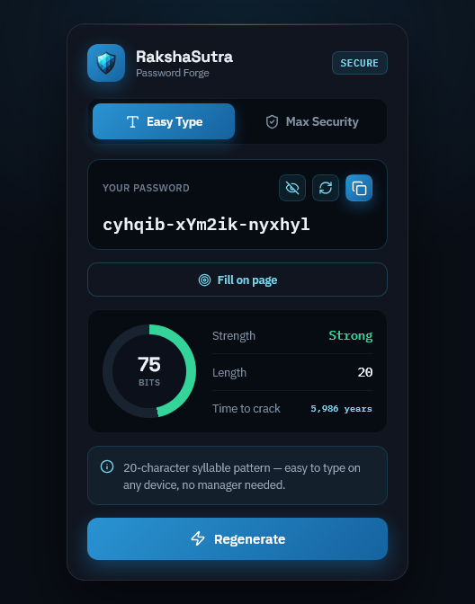

<div align="center">


# RakshaSutra

**A protective thread for every login.**

A privacy-first, cryptographically secure password generator that runs entirely in your browser.
No servers. No telemetry. No trace.

[](LICENSE)
[](#)
[](#)
[](#-security-model)
[](#-security-model)
[](#)

[Install](#-install) · [Why RakshaSutra](#-why-rakshasutra) · [Security Model](#-security-model) · [Verify It Yourself](#-verify-it-yourself) · [Develop](#-development)

</div>

---

RakshaSutra forges strong, unique passwords using the browser's native Web Crypto API. Every password is generated locally, on your device, in memory — and is **never stored, synced, logged, or transmitted anywhere.** The entire algorithm is open source and auditable, and the extension makes **zero network requests** at runtime. You don't have to trust that claim — [you can verify it](#-verify-it-yourself).

<div align="center">


</div>

---

## ✦ Why RakshaSutra

> *"My browser already generates passwords. Why install this?"*

Fair question. Here's the honest answer:

| | Browser built-in | RakshaSutra |
|---|---|---|
| **Auditable randomness** | Closed, account-tied | Open source, `crypto.getRandomValues`, [verifiable](#-verify-it-yourself) |
| **Entropy you control** | Fixed | 8–32 chars · up to ~209 bits · optional symbols |
| **Easy-to-type mode** | ✗ | Syllable-based passwords for phones, consoles, smart TVs |
| **Works without an account** | Tied to your browser profile | Fully local, no profile, no lock-in |
| **Modulo-bias eliminated** | Unspecified | Rejection sampling → provably uniform distribution |
| **Data leaves your device** | Synced to vendor cloud | Never. Zero network, zero storage. |

RakshaSutra is a **generator**, not a password manager — see [Scope](#-scope--roadmap) for exactly what that means and what it deliberately does *not* do.

---

## ✦ Features

**Two modes, one crypto core.**

- **🔐 Max Security** — Fully random, 8–32 characters, optional special characters. Rejection sampling removes modulo bias so the character distribution is perfectly uniform. Up to **~209 bits of entropy**.
  `kT!T30/HgD%2(~6|`

- **⌨️ Easy Type** — Syllable patterns produce 20-character passwords that are genuinely easy to type on any device — phone, console, or smart TV. Strong without the struggle.
  `v9gpYs-juhdaj-jozsix`

**Live security feedback** — entropy (bits), strength rating, and human-readable time-to-crack update *as you change settings*, not just on generation.

**One-click everything** — a password is ready the instant the popup opens (no empty state, no click required). Copy with one tap (or `Ctrl/Cmd+C`), with explicit "Copied ✓" confirmation.

**Fill on page** — inject the generated password directly into a focused password field — and the matching *confirm-password* field — on the active tab. Values are set through the native input setter so React/Vue-controlled forms register the change correctly.

---

## ✦ Security Model

This is a tool you trust with your credentials, so here is exactly how it behaves.

### Randomness
All entropy comes from [`crypto.getRandomValues()`](https://developer.mozilla.org/en-US/docs/Web/API/Crypto/getRandomValues) — the browser's CSPRNG. RakshaSutra never uses `Math.random()`.

### No modulo bias
Naively mapping random bytes onto a character set with `%` skews the distribution toward lower-indexed characters. RakshaSutra uses **rejection sampling**: random values that fall outside the largest unbiased range are discarded and redrawn, so every character in the set is equally likely. The result is a provably uniform distribution. The full implementation lives in [`src/lib/crypto-core.js`](src/lib/crypto-core.js) — read it, it's small.

### What is stored
**Nothing.** No password is ever written to disk, `localStorage`, `chrome.storage`, or browser sync. Generated values exist in memory only and are discarded when the popup closes.

### What is transmitted
**Nothing.** The extension makes no network requests at runtime — no analytics, no telemetry, no remote fonts, no CDN calls, no "check this password" lookups.

### Permissions

RakshaSutra requests the minimum permissions required, and nothing more:

| Permission | Why it's needed | What it does **not** allow |
|---|---|---|
| `activeTab` | Read the focused tab only when *you* click "Fill on page" | No background access, no browsing history, no access to other tabs |
| `scripting` | Inject the password into the focused field on demand | No persistent content scripts, no automatic injection |

There are **no `host_permissions`** — RakshaSutra cannot run on pages until you explicitly invoke it.

### Threat model

**RakshaSutra protects you from:**
- Weak, guessable, or low-entropy passwords
- Password reuse (by making unique generation effortless)
- Generation tools that exfiltrate or log what they create

**RakshaSutra does *not* protect you from:**
- A compromised browser or OS (it runs inside your browser's trust boundary)
- Phishing or shoulder-surfing
- Storing the password insecurely *after* you generate it — that's on you and your password manager
- Remembering your passwords — it generates, it does not store (see [Scope](#-scope--roadmap))

### Responsible disclosure
Found a security issue? Please **do not** open a public issue. Email `<your-security-contact>` instead. See [SECURITY.md](SECURITY.md).

---

## ✦ Verify It Yourself

Don't take "zero network, zero storage" on faith. Confirm it:

1. **No network access by design** — open [`public/manifest.json`](public/manifest.json) and confirm there are no `host_permissions` and no remote URLs.
2. **Watch it stay silent** — load the extension, open Chrome DevTools → **Network** tab on the popup, and generate dozens of passwords. There will be zero requests.
3. **Read the whole algorithm** — the entirety of the randomness, entropy, strength, and crack-time logic is one auditable file: [`src/lib/crypto-core.js`](src/lib/crypto-core.js).
4. **The landing page runs the same core** — the live demo on the website imports the *exact same* `crypto-core.js`, mirrored verbatim at build time. A CI guard ([`scripts/check-crypto-core-sync.mjs`](scripts/check-crypto-core-sync.mjs)) fails the build if the two ever drift, so what you audit is what ships.

---

## ✦ How It Works

```
                 ┌────────────────────────────┐
                 │  src/lib/crypto-core.js     │  ← single source of truth
                 │  (randomness · entropy ·    │     (rejection sampling,
                 │   strength · crack-time)    │      Web Crypto API)
                 └────────────┬───────────────┘
            imports           │           mirrored at build (postbuild)
        ┌───────────────────┐ │ ┌──────────────────────────────────┐
        │  Popup (React 19) │◄┘ └►│  public/crypto-core.js          │
        │  src/ → dist/     │     │  used by static landing page    │
        │  Manifest V3      │     │  public/index.html              │
        └───────────────────┘     └──────────────────────────────────┘
                                   (prebuild drift guard blocks mismatch)
```

- **Popup:** React 19 + TypeScript, bundled with Vite to `dist/` (the extension).
- **Landing page:** 100% static (`public/index.html` + `landing.css`), deployed by Vercel directly from `public/`.
- **Shared core:** `src/lib/crypto-core.js` is the *only* implementation. `scripts/copy-crypto-core.mjs` mirrors it into `public/` on `postbuild`; `scripts/check-crypto-core-sync.mjs` runs on `prebuild` and **fails the build** if the copies diverge — so source, extension, and website can never disagree on how a password is made.

> **A note on crack-time numbers:** time-to-crack is derived from password entropy under a documented offline-attack guess rate (see the constant in `crypto-core.js`). It's a conservative reference figure, not a guarantee — treat it as an order-of-magnitude signal.

---

## ✦ Install

**From the stores:**

<div align="left">

[](https://chrome.google.com/webstore/detail/rakshasutra/your-chrome-store-id)
[](https://addons.mozilla.org/en-US/firefox/addon/rakshasutra/)
[](https://microsoftedge.microsoft.com/addons/detail/rakshasutra/your-edge-store-id)

</div>

**From source:**

```bash
git clone https://github.com/suryanshparashar/rakshasutra.git
cd rakshasutra
npm install
npm run build      # outputs the extension to dist/
```

Then in your browser: `chrome://extensions` → enable **Developer mode** → **Load unpacked** → select the `dist/` folder. (Edge: `edge://extensions`. Firefox: `about:debugging` → **This Firefox** → **Load Temporary Add-on**.)

---

## ✦ Development

**Prerequisites:** Node.js ≥ 18, npm.

```bash
npm install
npm run dev        # Vite dev server for the popup
npm run build      # production build → dist/  (runs prebuild guard + postbuild mirror)
npm run lint       # ESLint
npm run check:crypto-sync   # verify src and public crypto-core are byte-identical
```

<details>
<summary><b>Project structure</b></summary>

```
rakshasutra/
├── src/
│   ├── lib/
│   │   └── crypto-core.js          # ★ single source of truth for all crypto math
│   ├── components/                 # React popup UI
│   └── ...
├── public/
│   ├── manifest.json               # MV3 manifest
│   ├── index.html                  # static landing page
│   ├── landing.css
│   └── crypto-core.js              # build-time mirror of src/lib/crypto-core.js
├── scripts/
│   ├── copy-crypto-core.mjs        # postbuild: mirror core into public/
│   ├── check-crypto-core-sync.mjs  # prebuild: fail build on drift
│   └── fetch-github-stars.mjs      # build-time star count for landing page
├── dist/                           # built extension (not deployed to the website)
├── MEASUREMENT.md                  # privacy-preserving retention metrics
└── SECURITY.md
```
</details>

<details>
<summary><b>npm scripts reference</b></summary>

| Script | Purpose |
|---|---|
| `dev` | Run the popup locally via Vite |
| `build` | Production build of the extension to `dist/` |
| `prebuild` | Auto-runs the crypto-core drift guard before every build |
| `postbuild` | Auto-mirrors `crypto-core.js` into `public/` |
| `lint` | ESLint across the codebase |
| `check:crypto-sync` | Byte-for-byte verify the two crypto-core copies match |

</details>

---

## ✦ Scope & Roadmap

RakshaSutra is intentionally a **generator**, not a manager. It is excellent at one thing: producing strong, unique passwords with auditable, local cryptography. It does **not** store, autofill-from-vault, or sync your passwords — by design, that's what keeps its attack surface near zero and its privacy promise honest. Pair it with a password manager you trust for storage.

- [x] Easy Type + Max Security modes
- [x] Live entropy / strength / crack-time
- [x] One-click copy + keyboard shortcut
- [x] Fill on page (password + confirm field)
- [x] Build-time integrity guard for the shared crypto core
- [ ] Localization (Hindi + regional languages)
- [ ] Configurable Easy-Type separators and word lists

---

## ✦ Contributing

Contributions are welcome. For anything beyond a typo fix, open an issue first so we can align on direction. Keep the core invariants sacred: **zero runtime network, zero telemetry, no password persistence, minimum permissions.** A PR that breaks any of these will be closed regardless of how good the feature is.

---

## ✦ License

[MIT](LICENSE) © 2025-2026 Suryansh Parashar · Made in Bharat 🇮🇳

<div align="center">

**Never reuse a weak password again.**

</div>